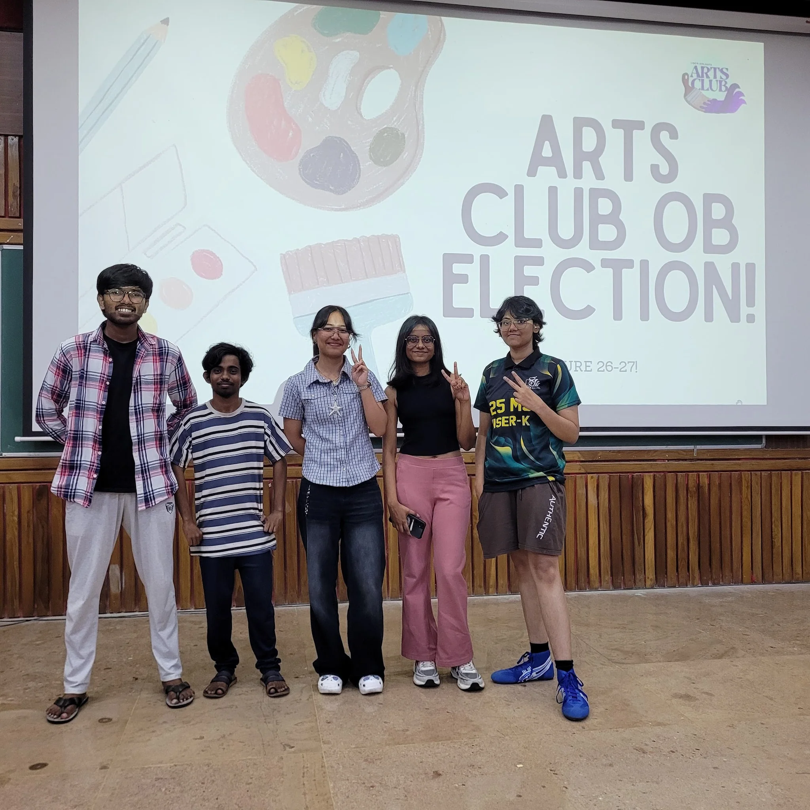
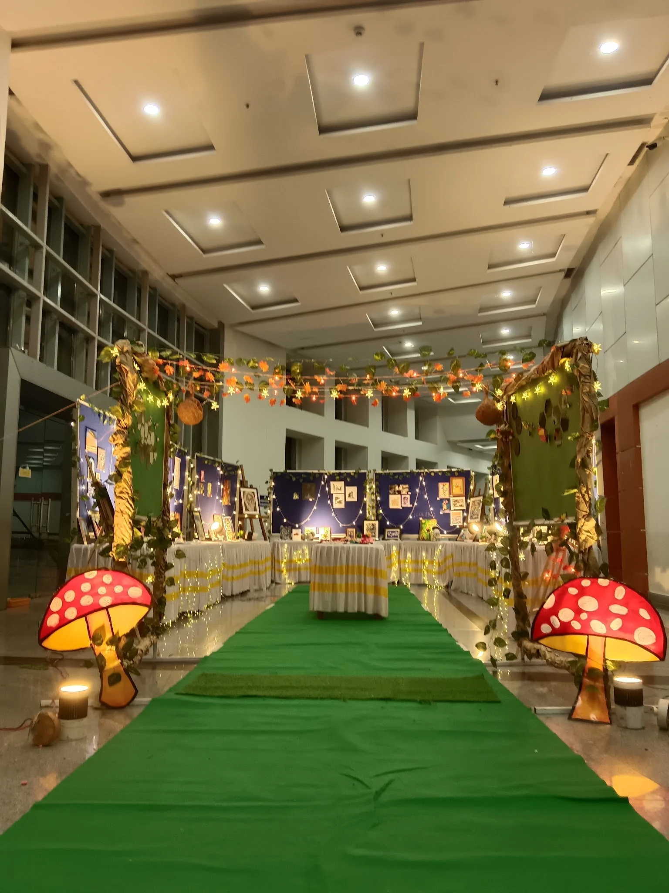

# Arts Club Of Iiser Kolkata

Arts Club of IISER Kolkata

Introduction

Arts Club of IISER Kolkata is undoubtedly the ultimate powerhouse for creativity in the campus, where all forms of imagination and visual expression are celebrated under one roof. Unlike a laboratory or classroom environment, this student body run club enlivens the student community through a variety of events and activities. This club is a great community that often partners with the various other Club for activities in order to integrate multiple fields, conducts various workshops on watercolors, charcoal paintings, paper crafting and digital arts, etc. The club operates and is managed by students themselves, including elected Office Bearers and club members.

CURRENT OFFICE BEARERS :

Tenure 26-27

(L-R;Omkar,Soumik,Ritisneha,Moupiya,Samadrita)

PREVIOUS OFFICE BEARERS

Flagship Events

1.Chitrakavyam

Chitrakavyam is an exhibition-cum-auction that celebrates the artistic talents of our student community. The event provides a platform for students to showcase their paintings and creative works while also giving them an opportunity to sell them to interested buyers.

2. Halloween

Halloween Party is a celebration packed with spooky fun and entertainment. From the costume party and escape room challenges to the DJ night and interactive stalls, the event offers an exciting experience where students can dress up, socialize, and enjoy a memorable evening together.

Social media

Insta

https://www.instagram.com/arts_club_iiserk/

Facebook

https://www.facebook.com/1214318562031239/

Email

arts.activity@iiserkol.ac.in

Whatsapp

https://chat.whatsapp.com/LYvsjScmj8i8pMR6H7abUi

| Name | Position | E-mail ID | Phone No. |
| --- | --- | --- | --- |
| Omkar Shinde | Secretary | oss25ms034@iiserkol.ac.in | +91 9823787760 |
| Soumik Roy | Convener | sr24ms009@iiserkol.ac.in | +91 6299325462 |
| Samadrita Saha | Treasurer | ss25ms057@iiserkol.ac.in | +91 8900626325 |
| Moupiya Mondal | Event Organiser | mm25ms282@iiserkol.ac.in | +91 8017425916 |
| Ritisneha Shyamali | Social Media Manager | rs25ms076@iiserkol.ac.in | +91 9707732565 |

| Tenure | Secretary | Convener | Treasurer | Event Organiser | Social Media Manager | OB Mentor |
| --- | --- | --- | --- | --- | --- | --- |
| 2025-2026 | Nandita Sriram | Harman | Shristi Chanda | Soumik Roy | Ruksana Taj |  |
| 2024-2025 | Sneha Chakraborty | Nandita Sriram | Tanisha Nath | - | - |  |
| 2023-2024 | Rounak Mukhopadhyay | Aikya Banerjee | Ditsa Roy |  |  |  |
| 2022-2023 | Kusumita Pradhan | Fathima Anjum EC | Sourashis Das |  |  |  |
| 2021-2022 | Trishita Patra | Biyas Choudhury | Baivab Kumar Saha |  |  |  |
| 2020-2021 | Aesha Lahiri | Mukil M | Sourin Chatterjee |  |  |  |
