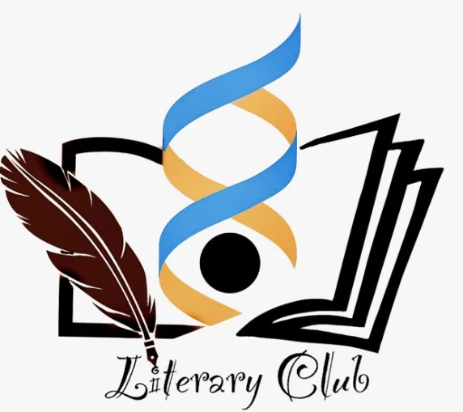

# Literery Club

INTRODUCTION TO THE LIT

The Literary Club of IISER Kolkata is a space for curiosity, creativity and conversation. We aim to foster an appreciation for literature, language, ideas and critical thinking by bringing together students who share an interest in reading, writing, discussion and debate.

Over the years, the club has organized a variety of activities designed to engage the campus community. Among these are our biweekly puzzles, word-game challenges, weekend games, poetry and short story writings, book discussions and debates. These events encourage participants to test their wit, creativity and problem-solving skills. The club's flagship event, Lexis, is an annual literary fest that celebrates the many facets of literary and intellectual culture through debates, quizzes, dramatic performances, competitions and interactive events.

Beyond competitions and festivals, the Literary Club serves as a platform for the exchange of ideas. Through discussions, talks and community-driven initiatives, we seek to create an environment where students can explore literature, philosophy, history, politics, culture and other subjects of shared interest. As the club continues to grow, we hope to expand these opportunities for dialogue and engagement, making the Literary Club a vibrant forum for both intellectual exploration and creative expression.

Whether you are an avid reader, an aspiring writer, a passionate debater, or simply someone who enjoys thoughtful conversation, the Literary Club welcomes you.

CURRENT OFFICE BEARERS:

Tenure 26-27

PAST OFFICE BEARERS:

Some obs of whom we don't the positions: 22-23: Kritika Margdarshini, Suvajit Dey,

Ananya Rout.

Events:

Literary club host numerous fun and deep events throughout the year, these events ranges from creative, poetic, and romantic to  philosophical, psychological, and competitive. While also including different literary Workshops of Learning and Fests of Fun. These flagship events include:

Lexis: One of the major canon events of IISER kolkata. The lexis fest goes from thriller  treasure hunts to the quiet reading rooms, providing thrill to the adventurers and a place of rest to the travelling scholars. This festival of lit includes events such as Treasure hunts, Reading room, Writing labs, wagers of the quiz, Mad ads of the theatre,

War of words and intellects, Clash of the worlds sci-fi, and board night and movie Screenings at the end of your endeavors in the lexis.

Week of the fiction: Named as Witch weekly in the previous year and  the event that took place in the walls of Hogwarts and world of Harry Potter. This is an event in which the lit family(everyone) chooses a fictional world and dedicates a week to it. Whether it's  getting sorted into the griffindor or Marching behind the King in the North. We prepare different events for all seven nights, the said events may  range from……this one a secret, attend the next Week of the fiction to find out.

Bi-Weekly:  A fun puzzle and a game of wit, held every two weeks, crafted by the blacksmiths of the Lit themselves. It is a game that rewards the winner and brings joy and a moment of rest in our swamped journeys.

ACHIEVEMENTS:

SOCIAL MEDIA LINKS :

Email Address : literary.activity@iiserkol.ac.in

Instagram : https://www.instagram.com/litclubiiserkol/

| Name | Contact no. | Email Address | Position |
| --- | --- | --- | --- |
| Dixita Adhikari | 81360 21946 | da25ms171@iiserkol.ac.in | Secretory |
| Mohammad Saif | 7724052175 | ms25ms094@iiserkol.ac.in | Convenor |
| Theertha S Nair | 81570 30024 | tsn25ms006@iiserkol.ac.in | Treasurer |
| Mohammad Adhil T P | 6282 840 743 | matp25ms181@iiserkol.ac.in | PR Head |
| Chaithanya Suresh | 85476 71449 | cs25ms238@iiserkol.ac.in | Event Organiser |

| Tenure | Secretary | Convenor | Treasurer | Social Media Manager | Event Manager | OB
Mentor |
| --- | --- | --- | --- | --- | --- | --- |
| 25-26 | Swathi Raveendran | - | Monisha G | - | Gayatri Das | - |
| 24-25 | Niravara Nag | Basudha Mukharjee | Adrika Chaudhuri | - | Swathi Raveendran | - |
| 23-24 | Tarak Yadav | Oindrilla Sarkar,
Adrika Chaudhuri | Niravara Nag | A.
Srinivas | - | - |
| 22-23 | Tarak Yadav |  |  |  |  | - |
| 21-22 | Nandhana KP | Tanishqa Ajay Chaubal | Srisindhu Bhatta,
Iyer Sriparameshwaram shankarnarayan | - | - | - |
| 20-21 | Abeg Dutta | Satbhav voltei | Aditya Dwarkesh | - | - | - |
