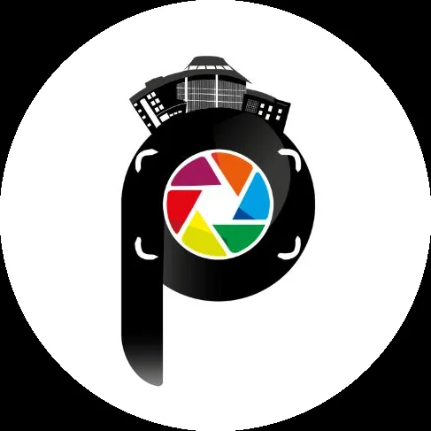

# Pixel Data Docx

# PIXEL
PHOTOGRAPHY CLUB

# INTRODUCTION

Pixel – The Photography Club of IISER Kolkata, consisting of both phone and DSLR photographers, is a space where students, faculty, and staff come together over a shared love for photography—not just to take pictures, but to learn how to truly see. For us, photography is as much about observation as it is about the camera, about finding meaning in everyday moments and turning them into something worth remembering. Most of our members are amateur photographers, and the club grows through shared experiences where people experiment, learn from each other, and gradually develop their own way of looking at the world, making photography both an art and an enjoyable hobby.

# CURRENT OFFICE BEARERS (26-27 Tenure)

Secretary
Name - Pratham B. Sarma

Mail - pbs25ms048@iiserkol.ac.in

Contact: +91 9954971648

Convener

Name - Mayank Acharya

Mail - ma25ms129@iiserkol.ac.in

Contact - +91 8093424670

Treasurer

Name - Soham Choudhury

Mail - sc25ms110@iiserkol.ac.in

Contact - +91 8584015899

Event Organiser

Name - Swapnadeep Sil

Mail - ss25ms074@iiserkol.ac.in

Contact - +91 8777830188

# OLD OFFICE BEARERS

# EVENTS:

FLAGSHIP EVENTS:

PHOTOWALKS

Photowalks are group explorations where photographers capture surroundings while improving observation and composition skills.

Our club organizes photowalks three to four times a year, often visiting nearby cities to experience diverse settings and cultures through the lens. Beyond being a creative and collaborative experience, photowalks also play a significant role in our achievements—many of our IICM selections are sourced from photographs captured during these walks, making them a major contributor to our success.

PHOTON

PHOTON is a photography-themed event hosted at Inquivesta, IISER Kolkata’s annual fest, inviting participation from colleges across India. It serves as a platform to showcase talent nationwide, bringing together creative minds and rewarding excellence with attractive prizes.

WEEKLY/MONTHLY SHUTTERCYCLES

Shuttercycle is a weekly online themed photography challenge that encourages participants to explore their creativity through diverse concepts. Each week, a new theme is announced, and photographers capture and submit images that best interpret it, focusing on elements like composition, storytelling, and originality. The initiative not only nurtures consistency and artistic growth but also provides a platform for recognition, as winners receive shoutouts on the official IISER Kolkata Instagram page, showcasing their work to a wider audience.

# ACHIEVEMENTS:

IICM 25 WINNERS

IICM 25 - Gold In Themed Photography

IICM 25 - Silver In Photostory

IICM 24 WINNERS

IICM 24 - Gold in Themed Photography

IICM 24 - Bronze in Stories In Clicks

IICM 23 WINNERS

Won Medals in 2023 IICM

# RULES:

## EQUIPMENT ISSUING RULES

1. Ownership

All equipment issued under this lending program remains the sole property of PIXEL – Photography Club, IISER Kolkata. Borrowing the equipment does not confer any ownership rights to the borrower.

2. Eligibility

Equipment may only be borrowed by currently enrolled students of IISER Kolkata. The borrower must have attended the camera handling workshop or have prior experience with the camera. A duly completed Equipment Lending Form, signed by a Pixel Office Bearer and the SAC Cultural General Secretary (Cult GS), must be submitted to the Dean of Students (DoS) Office before the equipment is issued.

3. Pre-Issue Inspection

Prior to receiving the equipment, the borrower must inspect it for any existing defects, damages, or abnormalities, including but not limited to scratches, dust, lens issues, or image stabilization malfunctions. Any such observations must be reported immediately to a Pixel Office Bearer. Failure to report existing issues before accepting the equipment shall imply that the equipment was received in satisfactory condition.

4. Permitted Usage

Borrowed equipment may only be used within the IISER Kolkata campus and its immediate surroundings for academic, cultural, or club-related activities. Removal of the equipment from the campus premises or taking it to the borrower's residence is strictly prohibited without prior written approval from the club and relevant authorities.

5. Responsibility for Damage or Loss

The borrower assumes full responsibility for the equipment throughout the borrowing period. Any loss, theft, damage, malfunction, or deterioration occurring during this period shall be the responsibility of the borrower. The cost of repair or replacement shall be assessed by the club office bearers according to the extent of the damage incurred.

6. Return Policy

The equipment must be returned personally by the borrower on or before the agreed return date and time. The maximum borrowing period shall not exceed 12 days unless an extension has been formally approved by the club office bearers.

7. Late Return Penalty

A late fee of ₹50 per day shall be imposed for each calendar day beyond the agreed return date. Continued failure to return the equipment may result in suspension of future borrowing privileges and further action as deemed appropriate by the club and institute authorities.

8. Acceptance of Terms

By signing the Equipment Lending Form, the borrower acknowledges that they have read, understood, and agreed to abide by all rules and regulations stated herein.

## PIXEL ROOM USAGE

1. Prior to using the Pixel Room, individuals must obtain permission by emailing both the Pixel Club and the Lit Club. The approval email must be presented to the guard before accessing the room.

2. Any unauthorized use of the Pixel Room may result in a ban from future access.

# EQUIPMENTS

1. Camera Bodies

Currently, Pixel Club has 2 types of camera bodies:

Sony Alpha ILCE 6400L – Mirrorless

Nikon D5300 – DSLR

2. Lenses

Currently, Pixel Club has 3 different types of lenses:

Nikon Compatible

Nikon AF-P 18–55mm f/3.5–5.6 VR II Kit Lens

AF-S NIKKOR 200–500mm f/5.6E ED VR

Sony Compatible

Sony Alpha 16–50mm Kit Lens

3. Supporting Equipment

Kodak T2100 Tripod Stand

Samsung 256 GB SD Card

SanDisk 256 GB SD Card

# SOCIALS

Instagram: https://www.instagram.com/pixel.iiser_kolkata/

Whatsapp:  https://chat.whatsapp.com/IOyeSsQVcxm9WIAIsWdeJJ

Website:   https://www.iiserkol.ac.in/~photography.activity/index.html

Email:     Photography Club of IISER Kolkata

| Term | Secretary | Convener | Treasurer | Event Organiser |
| --- | --- | --- | --- | --- |
| 2025-2026 | Muhammed Zain Aman K M | Basila Shahin K | Sameer Kumar Sahu | Divyanshu Raj Tiwari |
| 2024-2025 | Thejas Suresh | Ananta Mahatme | Swarnendu Saha | - |
| 2023-2024 | Sandeep Kumar | Tijare Mandar Rajesh | Baibhab Karmakar | - |
| 2022-2023 | Sandeep Kumar | Sabyasachi Das | Tejendra Singh | - |
| 2021-2022 | Subhashis Haldar | Sanskar Bhagowati | Udit Ghosh | - |
| 2020-2021 | Dwaipayan Dubey | Subhashis Haldar | Udit Ghosh | - |
| 2019-2020 | Siddharth Khan | Kaustav Gangopadhyay | Navonil Saha | - |
| 2018-2019 | Harshvardhan Borde | Amlan Datta | Sadhna Hasda | - |
| 2017-2018 | Siddharth Khan | Amlan Datta | - | - |
| 2016-2017 | Naman Agarwal | - | - | - |
