# Previous Office Bearers

Slashdot has been run, year on year, by the following teams of OBs:

## OB (2020–21)

| Photo | Name | Batch |
|---|---|---|
| 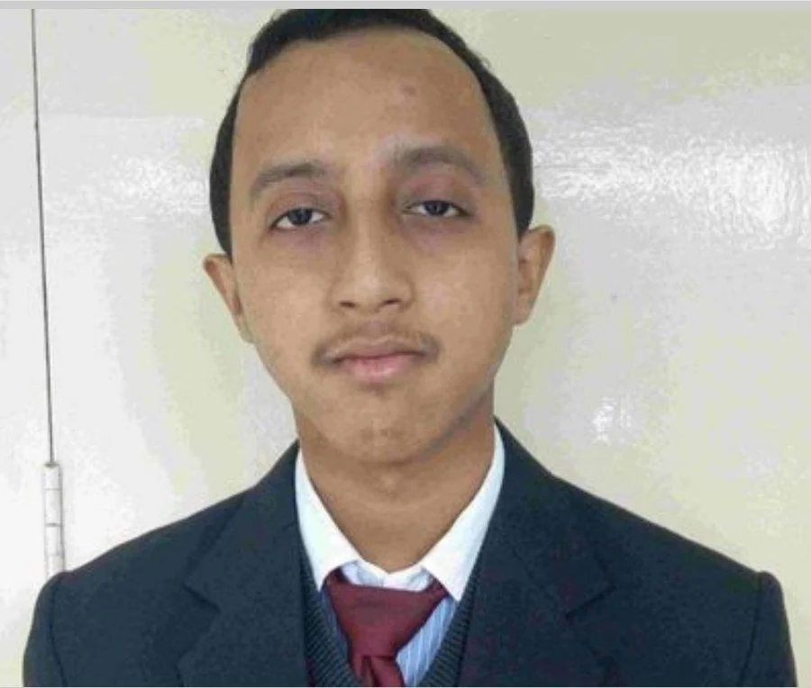 | Rahul Bordoloi | 18MS |
| 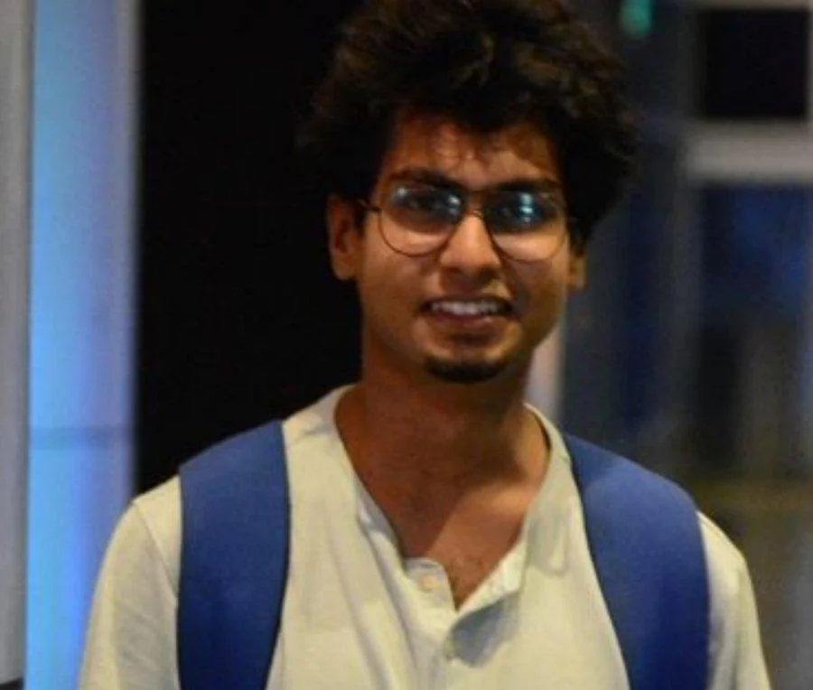 | Ritobroto Mohanta | 17MS |
| 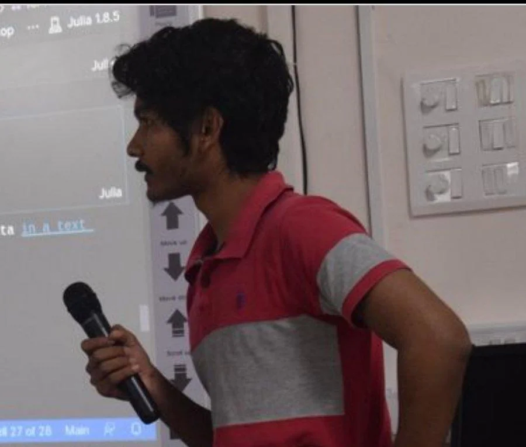 | Tushar Gayan | 19MS |

## OB (2021–22)

| Photo | Name | Batch |
|---|---|---|
|  | Anurit Dey | 19MS |
| 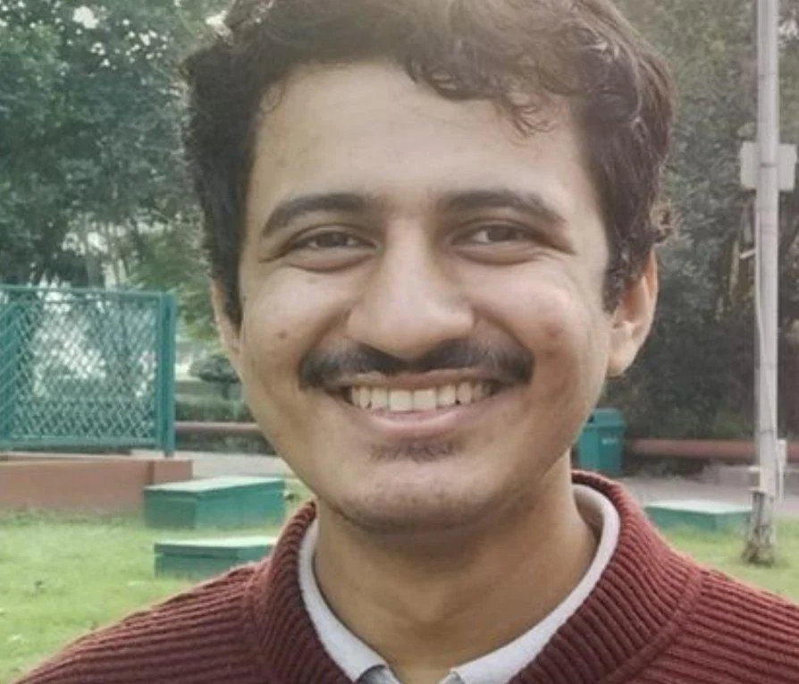 | Abhay Kshirsagar | 19MS |
| 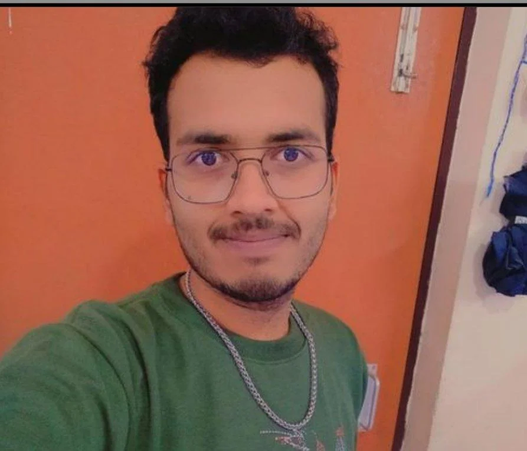 | Rohit Verma | 20MS |

## OB (2022–23)

| Photo | Name | Batch |
|---|---|---|
|  | Amardeepsingh Kushwah | 19MS |
| 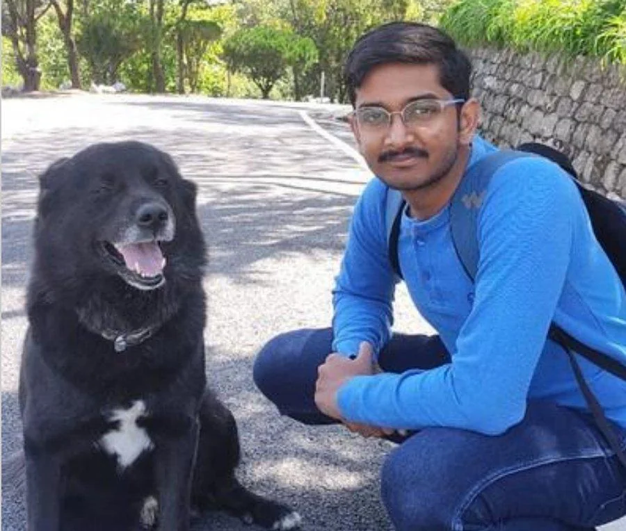 | Rohan Kumar | 21MS |
| 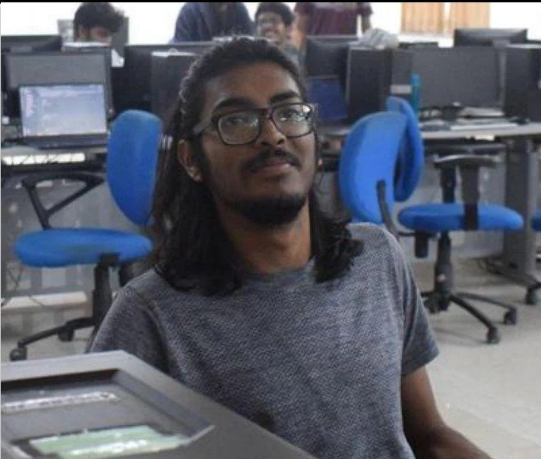 | Sattwamo Ghosh | 21MS |

## OB (2023–24)

| Photo | Name | Batch |
|---|---|---|
| 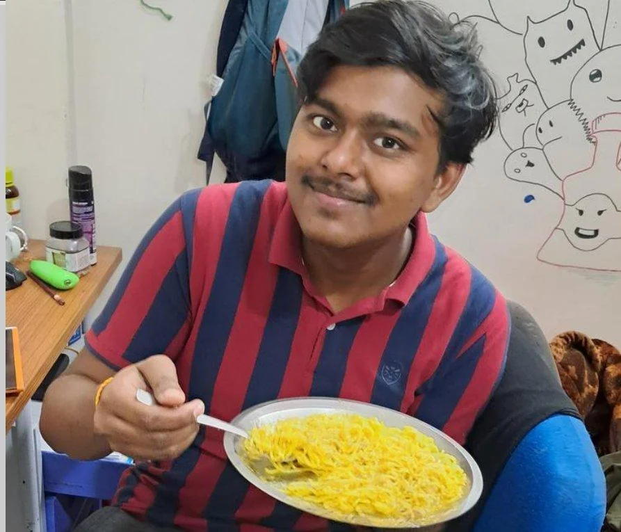 | Piyush Singh | 22MS |
| 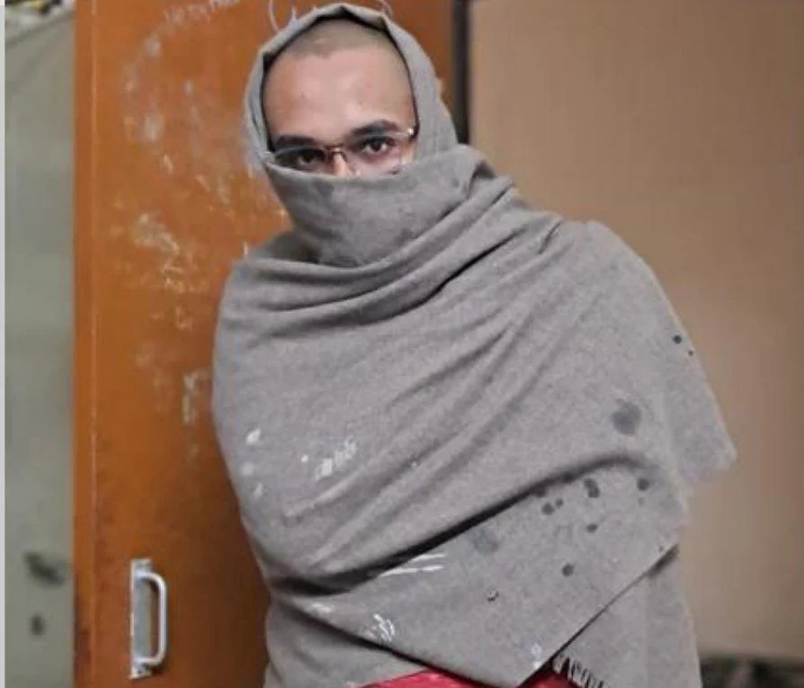 | Gautam Singh | 22MS |
|  | Nivas | 21MS |

## OB (2024–25)

| Photo | Name | Batch |
|---|---|---|
|  | Manish Behera | 23MS |
| 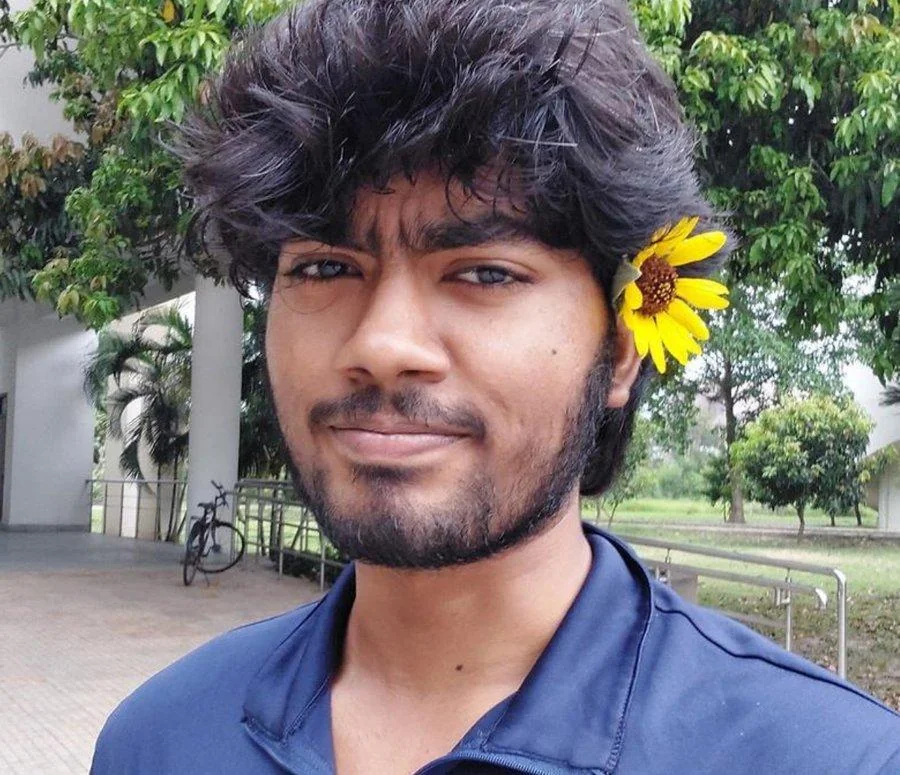 | Yelesh (Noob) | 23MS |
| 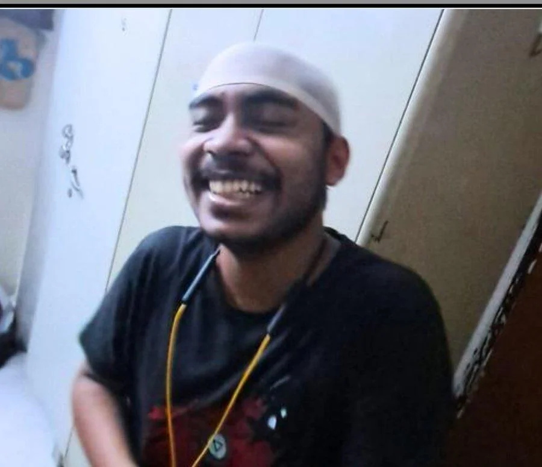 | Debayan Sarkar | 22MS |
