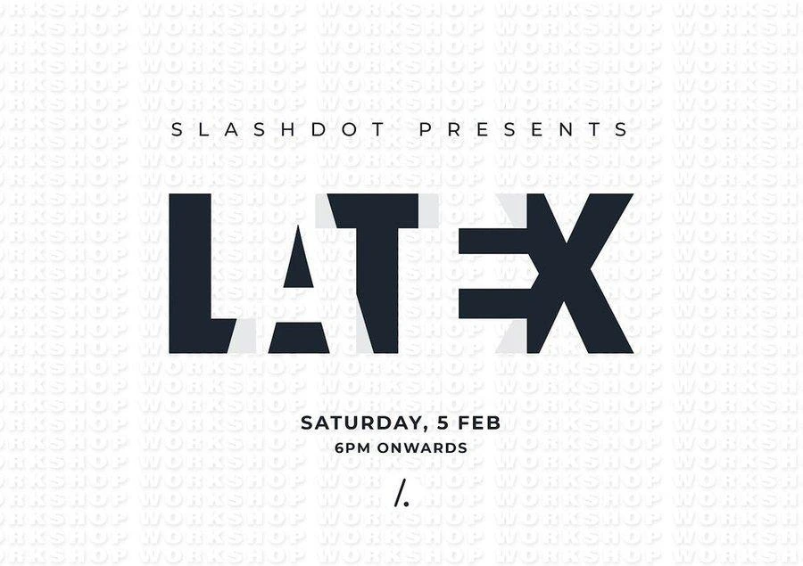
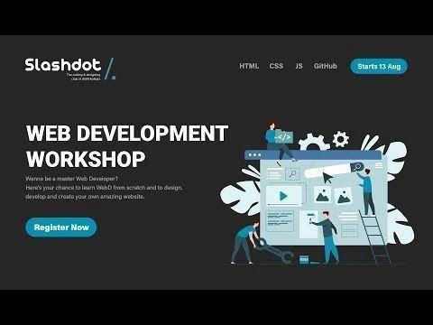
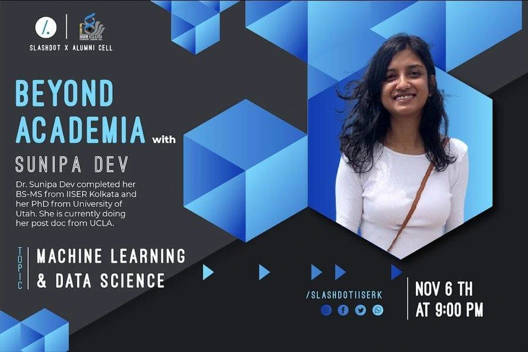

# Our Past Events

## LaTeX

A Slashdot-presented session on LaTeX, held on Saturday, 5th February, 6 PM onwards.

## Web Development Workshop

An introductory workshop covering HTML, CSS, JS and GitHub — "Wanna be a master Web Developer? Here's your chance to learn WebD from scratch, and to design, develop and create your own amazing website."

## Beyond Academia — with Dr. Sunipa Dev

A Slashdot x Alumni Cell session on Machine Learning & Data Science. Dr. Sunipa Dev completed her BS-MS from IISER Kolkata and her PhD from the University of Utah, and is currently doing her postdoc at UCLA. Held on 6th November at 9:00 PM.

