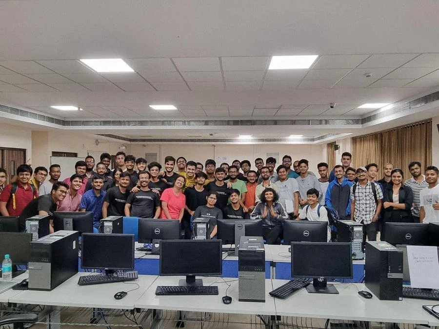
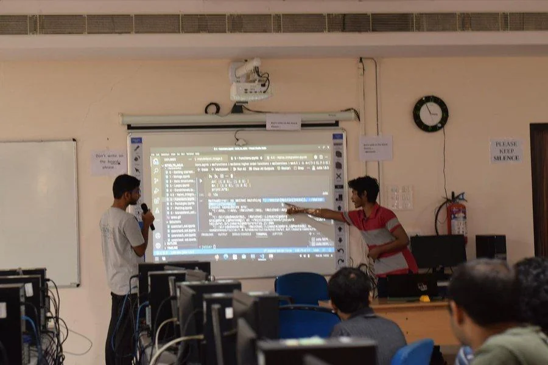
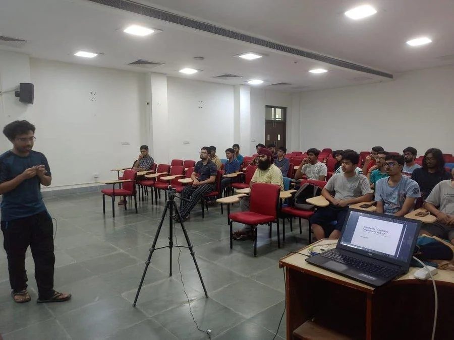
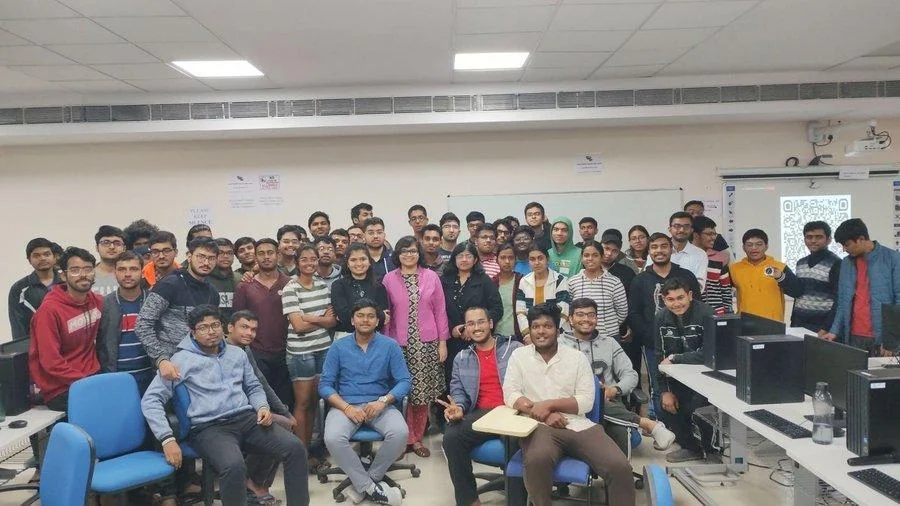
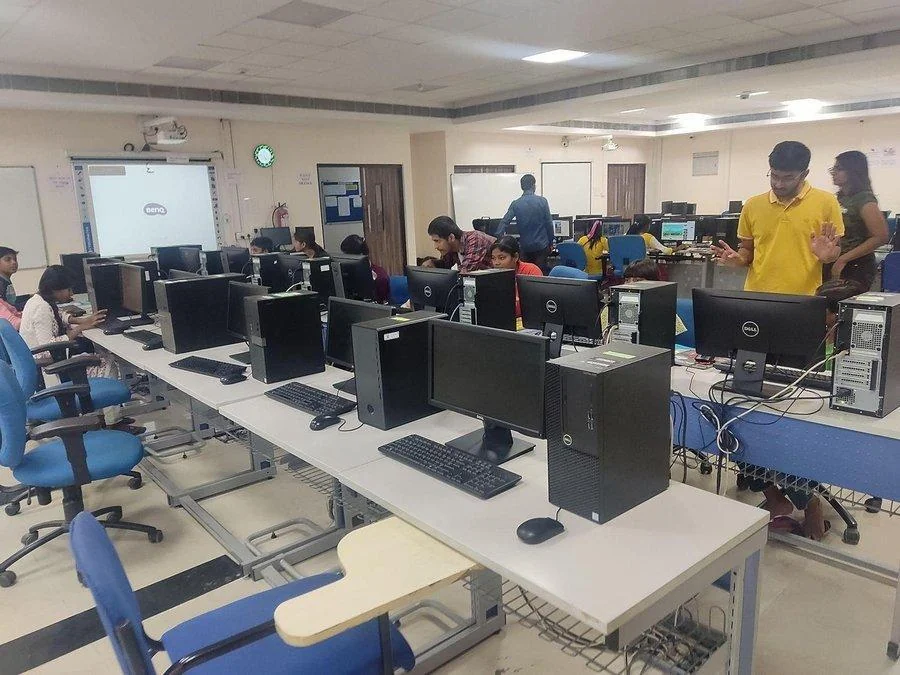
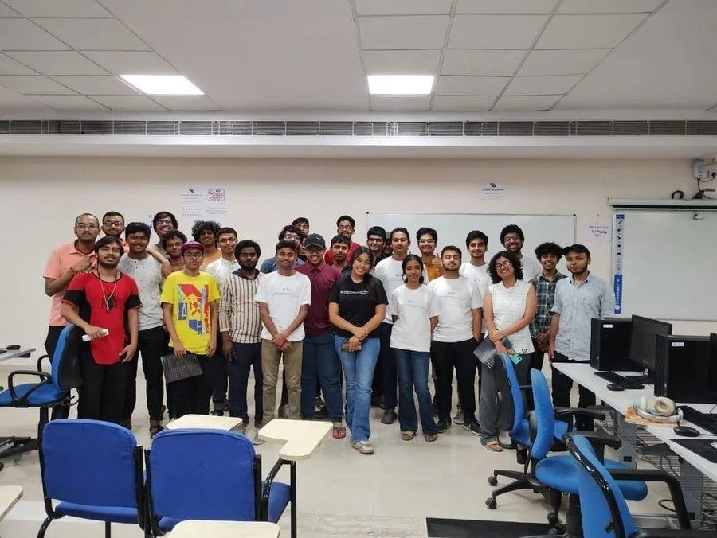
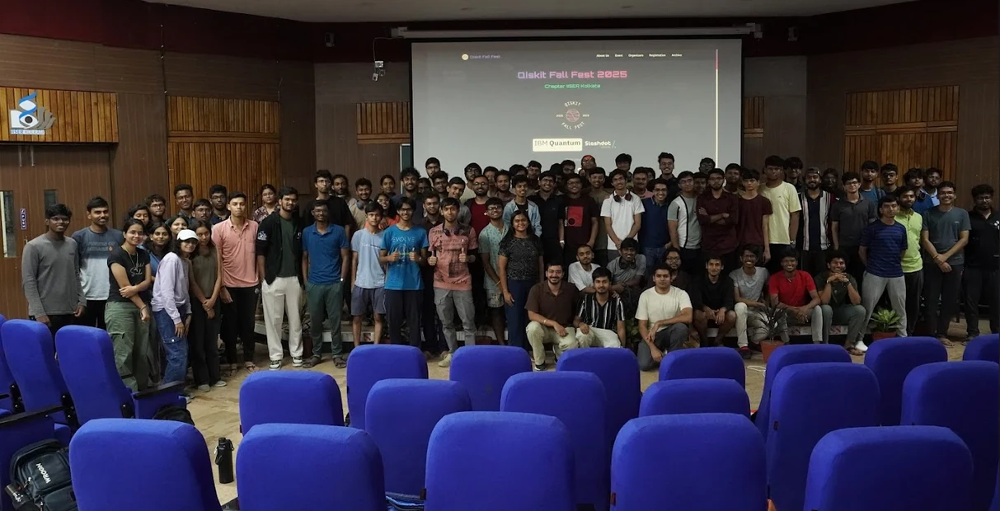

# Workshops Conducted

## Workshop on GitHub and Open Source

Conducted in collaboration with IIIT Kalyani.

## Workshop on Julia

An introduction to a rather new programming language. Conducted by Tushar Gayan (19MS).

## Workshop on Competitive Programming

A comprehensive guide to Competitive Programming (CP) and Google Summer of Code (GSoC). Conducted by Ananyapam.

## Workshop on LaTeX

Conducted by Piyush, Sabarno, and Debayan (22MS).

## Teaching Sessions for the Ek Pehal Students

A collaboration with the Ek Pehal team.

## Workshop on Web Development

Conducted in collaboration with IIIT Kalyani.

## Workshop on V-Roid Studio

Conducted by Team Inquicon (Savith, Arkadeep).

## Qiskit Fall Fest

Conducted in Collaboration with IBM Quantum.

