# Acik Budget (2026 2027)

## Page 1

ATHLETICS CLUB OF IISER KOLKATA  
BUDGET (2026 - 2027) 
 
 
1.​ CONSUMABLES 
 
S. 
No. 
Consumable Name 
Estimated 
Price 
(Rs.)/Unit 
Quantity 
Total Price 
(Rs.) 
Product 
image 
Product link 
1. 
Line marking powder 
100/kg 
150kg 
15000 
 
 
2. 
Medals 
40 
500 
20000 
 
 
 
Certificate 
20 
500 
20000 
 
 
3. 
U Shape nail 
10/piece 
200 
2000 
 
 
5. 
Chest Number Bibs (1-1000) 
5000 
1 set 
5000 
 
 
6. 
Equipment maintainance & 
repairing cost 
 
 
10000 
 
 
7. 
First Aid box 
1000 
1 set 
1000 
 
 
8. 
Water container 
300 
2  
600 
 
 
Total (Rs.) 
67,000

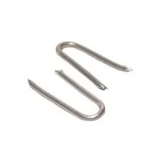

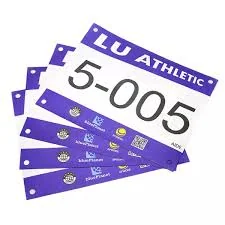

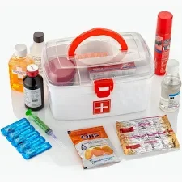

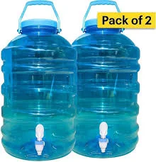

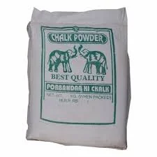

## Page 2

2.​ ASSETS  
 
S. 
No. 
Asset Name 
Estimated Price 
(Rs.) / Unit 
Quantity 
Total Price 
(Rs.) 
Product 
image 
Pro 
1. 
Rope (28-30mm) 
100rs/metre 
500m 
50000 
 
 
 
Starting Block  
5000 
4 
20000 
 
 
https://amzn.in/d
/04MuM3UR​
 
 
Medicine ball 
(1kg,2kg,4kg) 
1000 
3 
3000 
 
https://amzn.in/d
/0bZMhprI​
​
https://amzn.in/d
/0hyVPcrc​
​
https://amzn.in/d
/0anF6cq7​
​
 
 
Omtex power ball 
(400g,600g,800g) 
600 
3 
1800 
 
https://amzn.in/d
/09w61Sw6​
 
 
Mini Hurdles 
100 
40 
4000 
 
https://dl.flipkart
.com/s/Iw2TQg
NNNN​
 
 
Plyo box (24,18,12,6 
inches) 
1000 
4 
4000 
 
https://amzn.in/d
/087uXZEL​

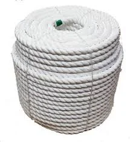

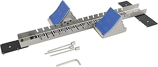

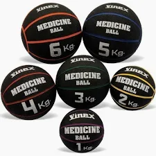

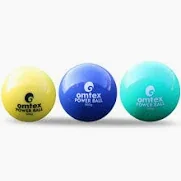

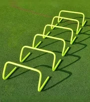

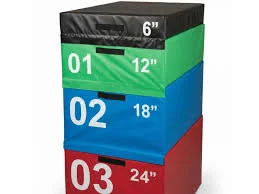

## Page 3

Rubber band 
200 
5 
1000 
 
https://amzn.in/d
/0dq6S2fG​
 
 
Rubber cable 
200 
5 
1000 
 
https://dl.flipkart
.com/s/IwKaHx
NNNN​
 
 
Disc cones 
20 
100 
2000 
 
https://amzn.in/d
/0iIW0wXd​
 
 
Speed ladder 
500 
1 
500 
 
https://amzn.in/d
/09A8J3F8​
 
 
Running chute 
500 
1 
500 
 
https://amzn.in/d
/0h5RGvML​
 
2.. 
Stopwatch 
400 
4 
1600 
 
https://amzn.in/d
/0bcWGSfi​
 
3. 
Full-Size Umbrella 
1500 
4 
6000 
 
https://amzn.in/d
/0gIO4Kbk​
 
4. 
PVC Pipe 6 (inches) 
1000/metre 
3 m 
3000 
 
 
5. 
Plastic flag 
50 
50 
2500 
 
https://amzn.in/d
/01r334bE​
 
6. 
Flag(Red White) 
250 
2 
500 
 
https://amzn.in/d
/09NMWon7​

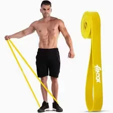

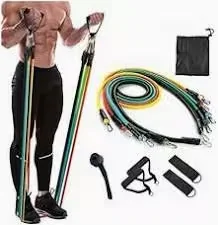

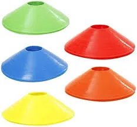

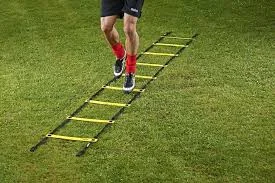

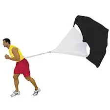

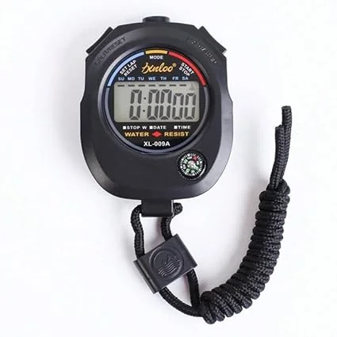

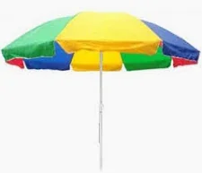

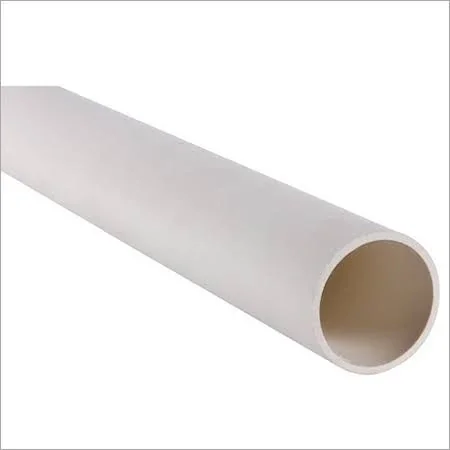

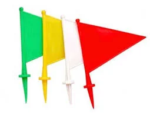

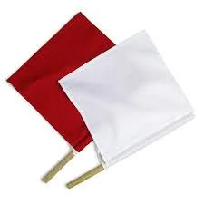

## Page 4

7. 
Judge’s Stand 
10000 
1 
10,000 
 
Judge’s Stand 
8. 
Long Jump Pit cover 
4000 
1 
4000 
 
https://amzn.in/d
/0iUfCZPs​
 
9. 
High jump stand & pole 
7000 
1 
7000 
 
 
10. 
High jump mat and cover 
40000 
1 
40000 
 
 
11. 
9m Pole 
8000 
3 
24000 
 
 
12. 
Flag(IISER K, 
ACIK,Pratap) 
400 
3 
1200 
 
 
13. 
 
 
 
 
 
 
14. 
2.5 kg discus 
1600 
1 
1600 
 
 
15. 
Multipurpose Sports Mat 
4000 
10 
40000 
 
 
16. 
 
 
 
 
 
 
17. 
 
 
 
 
 
 
18. 
 
 
 
 
 
 
19. 
 
 
 
 
 
 
20. 
 
 
 
 
 
 
21. 
 
 
 
 
 
 
Total (Rs.) 
1,87,600 
 
 
** Shipping charge is included.

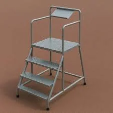

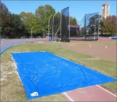

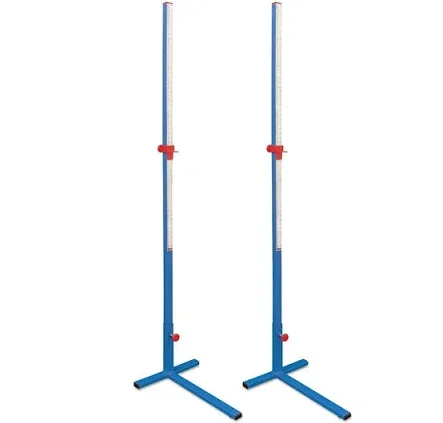

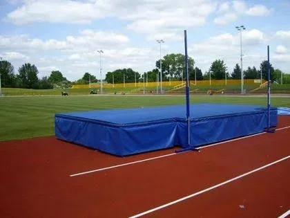

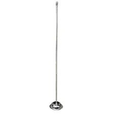

## Page 5

3.​ EVENT COUNDUTION​
 
A.​ Fees for Officials -  
Athletics Interbatch: 
●​ Fees quoted by 1 official for 1 day = Rs. 2,000 
●​ Number of officials required for a day = 2 
●​ Total Fees for a single day = Rs. 4,000 
●​ Expected no. of days when officials are required = 6 
●​ Total Charge of officials for 6 days = Rs. 24,000 
 
 
B.​ Refreshments - 
For Freedom Run, Ganarajyam Pride Run, Ekta Divas Run, and others = Rs. 
20,000 
 
C.​ Events and Marathons -  
 
S. No. 
Name of the Run 
Estimated Budget based on this year’s 
expenses (Rs.)* 
1. 
Fit India Freedom Run 
39,000 
2. 
Ganarajyam Pride Run 
39,000 
3. 
Open IISER Sprint meet 
10,000 
4. 
Open IISER Jump meet 
10,000 
5. 
Open IISER Throw meet 
10,000 
6.. 
Ekta Divas Run 
39,000 
   7. 
Intracollege Cycling 
Event 
15,000 
Total (Rs.) 
1,76,,000 
 
*NOTE: In this (runs and marathons) section, the specified amount represents the total 
estimated cost for T-shirt distribution, certificates, and other related expenses. 
 
 
4.​ INFRASTRUCTURE REQUIREMENTS 
     
●​ Athletics room reconstruction

## Page 6

●​ Safety cage for throwing sector 
 
 
 
​Steel poles(15-18 feet) 6 set x 5000=30000 
​Nylon net 1 set  15000 
​Concrete base for pole 6 set x 2000 =2000 
​Rope 1 set 3000 
​Hooks 2000 
​Welding 10000 
​Painting 3000 
​Transport charge 5000 
​Labour charge 6000 
  
Total = 76000 
 
 
 
 
●​ Torch & Fire Cauldron 
-​
Torch = Rs. 4,000 
-​
Base bowl for cauldron = Rs. 5,000 
-​
Pole = Rs. 10,000 
-​
Pedestal = Rs. 3,000 
-​
Safety Fencing = Rs. 1,500

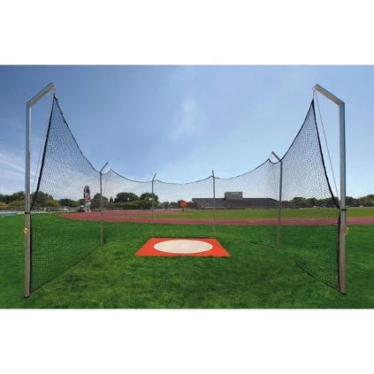

## Page 7

-​
Miscellaneous = Rs. 10,000 
-​
Total = Rs. 1,09,500 
 
TOTAL - Rs. 5,40,100
