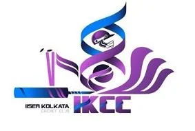

# Ikcc Budget(2026 27)

## Page 1

IISER - KOLKATA CRICKET CLUB (IKCC)
Budget Proposal for Financial Year 2026–2027
1. Consumables
The following consumables are requested for purchase. These items are crucial to ensuring continuous club
operations and safety during the upcoming competitive term.
Item
Unit Price (INR)
Quantity
Total (INR)
Batting helmets
2,000
3
6,000
GM Kashmir Willow Bat
2,000
1
2,000
English Willow Bats
10,000
2
20,000
Scoop bats
1,000
2
2,000
White Leather Balls for 30 overs
480
80
38,400
Synthetic balls
120
6
720
Flash tour golf balls
120
6
720
Moonwalker thigh guards
2,600
2
5,200
Left-handed (Lefty) thigh guard
1,000
1
1,000
SG cricket batting Pads
3,000
2
6,000
Batting gloves
2,500
3
7,500
Wicketkeeping gloves
4,000
1
4,000
Wicketkeeping pad
2,000
1
2,000
Plastic spring stumps
2,000
2
4,000
Flexible rubber stump
4,000
1
4,000
Sets of spot cones
200
2
400
Agility ladder
300
1
300
Grip cone
300
1
300
English tape
60
10
600
Bat grips
100
10
1,000
Total Consumables Cost
106,140 INR
IISER Kolkata Cricket Club • Final Budget Proposal FY 2026-2027
1

## Page 2

Note: These consumables are essential for the continued operations of the club, as most existing stock is
significantly worn out and unfit for further competitive use. 
2. Bat and Gear Repair Budget
During various scheduled events—such as IISM practices, inter-batch matches, and intensive IPL-style tournament
fixtures—essential equipment like bats and protective gear (pads, gloves) frequently require standard repairs,
maintenance, or professional re-stitching.
Estimated Allocation: 10,000 INR
3. Match Budgets
A. Umpiring
To ensure unbiased, standard professional execution during tournament matches, external umpiring services are
provisioned:
Standard Charge per Match: 800 INR (covering both official umpires)
Total Matches Planned: 30 matches total (comprising 20 IPL tournament fixtures + 10 structural Inter-batch
matches)
Total Projected Allocation: 800 × 30 = 24,000 INR
B. Refreshments
Necessary field refreshments will be systematically distributed across practice matches, the official campus IPL,
and Inter-batch tournaments. This pool also covers official refreshments catered to administrative guests and
dignitaries, including the Dean of Students' Affairs (DoSA), Associate DoSA, and active visiting members of the
Games and Sports Committee.
Estimated Allocation: 7,000 INR
4. Assets
A. Sight Screen
A sight screen stands as a vital structural safety asset, positioned strategically at the boundary edge directly behind
the operational bowler. Its primary function is to deliver a uniform, high-contrast backdrop, allowing batsmen to
critically track ball trajectory, velocity, and rotation out of the hand at speeds exceeding 100 km/h without crowd-
based visual distractions.
Estimated Allocation (2 Units): 70,000 INR
Budget Uncertainty Notice: Please note that this item's structural valuation holds a degree of uncertainty. Exact
pricing is subject to fluctuating raw fabrication quotes and variable final construction/installation logistics on-site. 
B. Pitch Covers
Procuring heavy-duty pitch protection covers remains absolutely vital for maintaining the newly constructed facility.
Estimated Allocation: 5,000 INR
• 
• 
• 
IISER Kolkata Cricket Club • Final Budget Proposal FY 2026-2027
2

## Page 3

5. Trophies and Medals
This fund is allocated for provisioning official recognition assets, awards, custom medals, and championship
trophies for winning teams, runners-up, and individual tournament standouts (e.g., Player of the Tournament, Best
Bowler, Best Batsman) across the 20 IPL fixtures and Inter-batch formats to foster structural student sports
engagement.
Estimated Allocation: 6,000 INR
Budget Summary Dashboard
1. Consumables Inventory
106,140 INR
2. Equipment & Gear Repair Reserve
10,000 INR
3. Match Execution (Umpiring & Refreshments)
31,000 INR
4. Fixed Club Assets (Sight Screens & Pitch Covers)
75,000 INR
5. Tournament Awards (Trophies & Medals)
6,000 INR
Total Proposed FY 2026–2027 Budget
228,140 INR
Prepared by:
IKCC Office Bearers (OBs) 2025–26
The Cricket Club of IISER-K
IISER Kolkata Cricket Club • Final Budget Proposal FY 2026-2027
3

