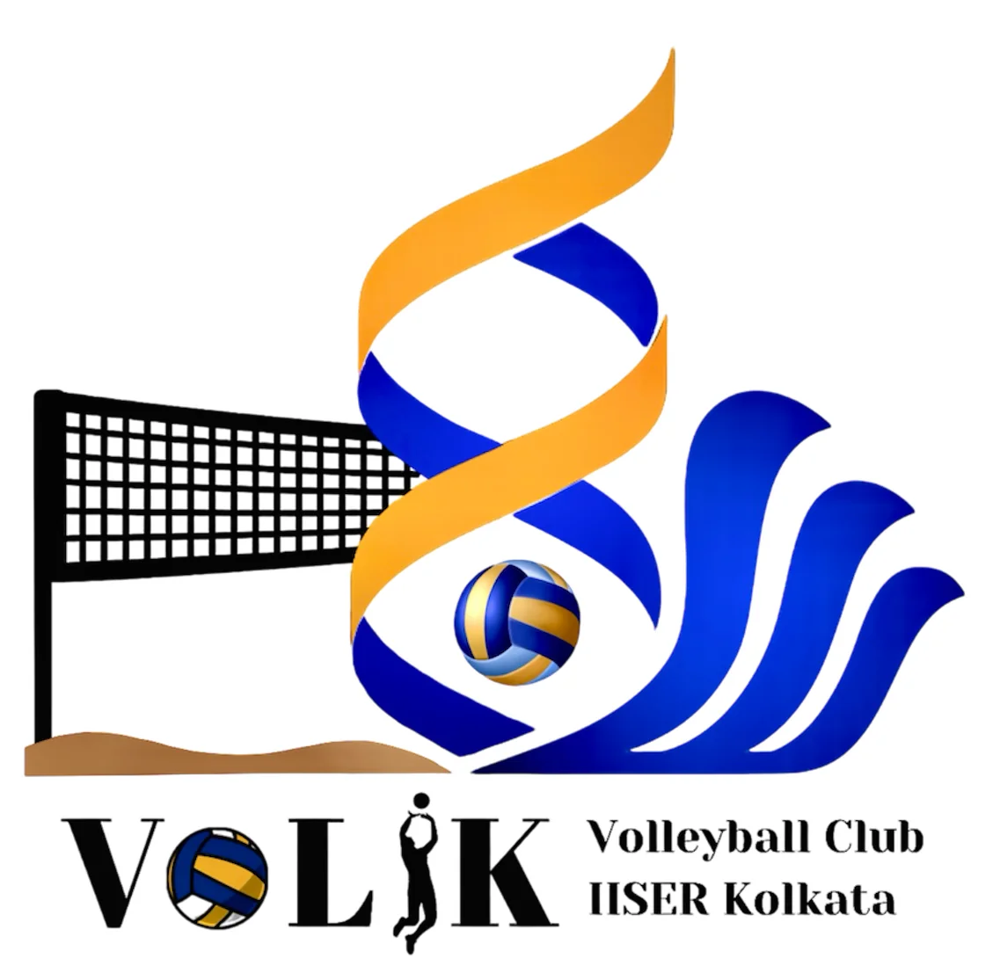

# Volik About

## Page 1

VOLIK
Volleyball club of IISER Kolkata
About VOLIK
At IISER Kolkata, we believe that a truly rounded education balances rigorous academic research with the
vibrancy of student life and sports. As a core pillar of this vision, the Volleyball Club (VOLIK) stands as
one of the most engaging and widely participated communities on campus. We are committed to building
a larger, inclusive volleyball family, where the joy of every spike and the energy on the court serve as a
powerful recharge from our demanding academic schedules.
Our competitive spirit is as strong as our community bond. Our silver medal achievement at the 2025
IISM (Inter IISER Sports Meet) proves that our players are far from casual; every move on the court is
calculated, precise, and executed with an ace-like focus. Furthermore, we are incredibly proud of the recent
surge in women’s participation. We are currently witnessing a new era for sports on campus, where the
growing presence of talented female athletes is redefining our competitive landscape and inspiring the next
generation of players.
Beyond our current members, we are supported by a formidable alumni network known as ”VOLIK-Star.”
This dedicated community stays deeply connected to our roots, providing not only mentorship and guidance
but also essential financial assistance that has been instrumental in the growth and professionalization of
our club.
Connect With Us
• Facebook Channel: Click here to join
• Instagram: volleyiiserkol
• YouTube: Volleyball Club of IISER Kolkata
• Website: https://volik-website.vercel.app/
• Faculty In-Charge (FIC): Dr Shibananda Biswas (DMS)
• Current Office Bearers (2025–2026):
– Shashank Sekher Sahu (22MS) - Secretary
– Krishna Tiwari (23MS) - Treasurer
– Anik Jana (23MS) - Convenor
– Aanshika Yadav (24MS) - Convenor
– Lipsamayee Mishra (24MS) - Convenor
1

